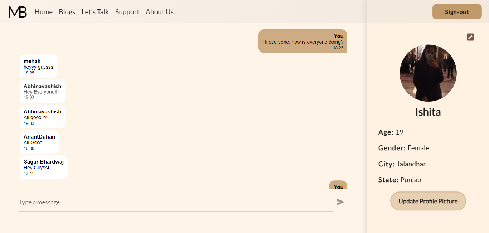
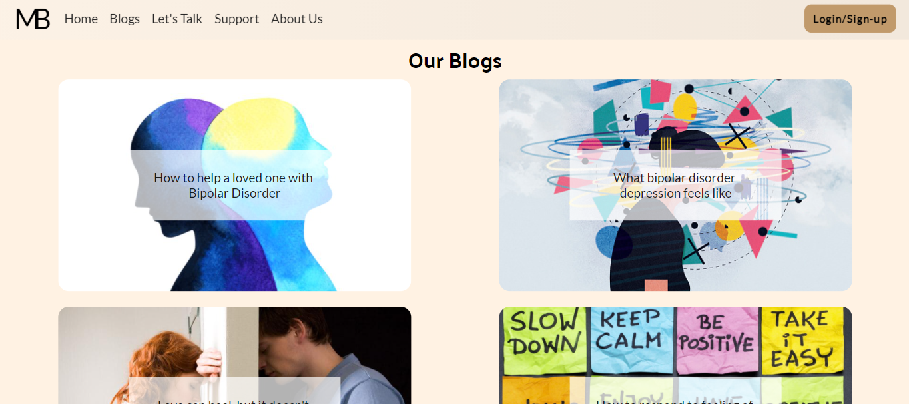
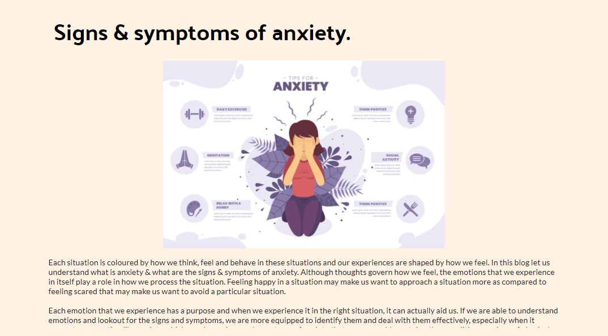

## Mood Buster
A growing community working towards changing the way individuals think and act to mental helath problems.

## Motivation
Mental Health influences how you think, feel, and behave in daily life. It also determines how we handle stress, relate to others, and make choices. Mental health is important at every stage of life, from childhood and adolescence through adulthood.

## A glimpse to website








## Link to Website
https://mood-buster-app.web.app/#/

## Tech/framework used
- Flutter
- FireBase Firestore

## Features
- Interact with people via chat forum
- Read blogs related to Mental Health and its related problems.
- Interact with team via Support panel

## Getting Started
**Step 1:**
Download or clone this repo using the link given below
```
https://github.com/IshitaArora-246/moodBuster.git
```

**Step 2:**
Go to project root directory and execute following command in terminal
```
flutter pub get
```

**Step 3:**
Run the project in Localhost 5000 using following command
```
flutter run -d chrome --web-renderer html --web-port 5000
```

